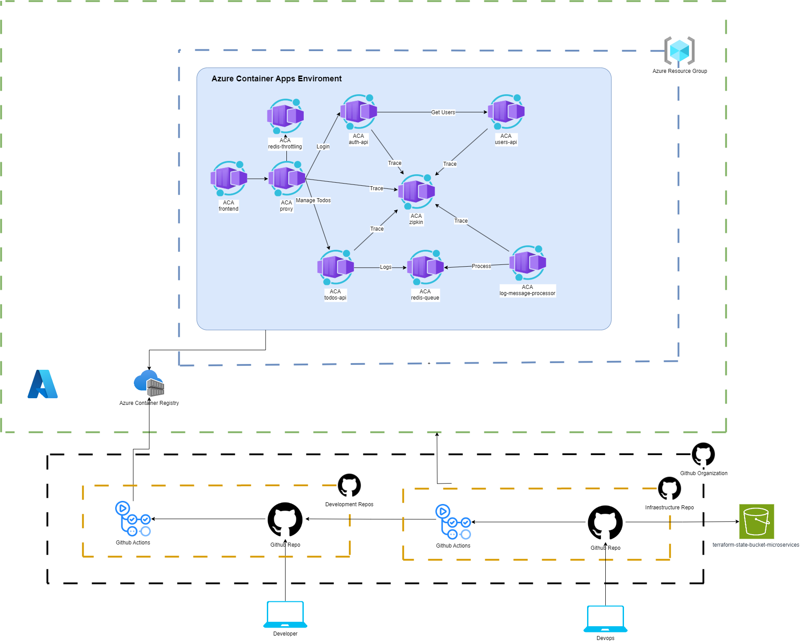

# Microservices-TODO Docs

## Alejandro Córdoba Erazo
## Alejandro Londoño Bermúdez

# 👥 Tech Team Composition

### Head of Tech

- **1 Solutions Architect**

### Development

- **1 Junior Frontend Engineer**
- **1 Senior Frontend Engineer**

- **2 Junior Backend Engineers**
- **3 Intermediate Backend Engineers**
- **1 Senior Backend Engineer**

### Operations

- **1 Intermediate DevOps Engineer**
- **1 Junior DevOps Engineer**

# Microservices Workflow

# Agile Methodology Proposal: Kanban

Characteristics 
- **Small team**: Kanban is well-suited for small, focused teams.
- **Continuous workflow**: Emphasizes a continuous flow of tasks without long iterations.
- **Ideal for operations and deployment tasks**: Works well for operational teams, allowing efficient management of deployment and infrastructure tasks.
- **Quick blockage visualization**: Visualizes any workflow blockages quickly, allowing for faster resolution.

## Develop Team Branching Strategy: GitHub Flow

- **Branches**:
  - `develop`: Main development branch.
  - `feature/desc`: Branch for feature development, named based on the feature description.
  - `bugfix/desc`: Branch for bug fixes, named according to the issue being fixed.
  - `hotfix/desc`: Branch for urgent fixes.

- **Workflow**:
  1. Start from the `develop` branch: `git checkout -b feature/desc main`.
  2. Develop changes in the `feature/desc` branch.
  3. Create a Pull Request (PR) to merge changes into the `develop` branch.
  4. The PR undergoes a review process.
  5. Once approved, the feature is merged into `develop`

## Operations Team Branching Strategy: GitHub Flow

- **Branches**:
  - `develop`: Main branch for all operational code.
  - `feature/desc`: Branch for infrastructure-related features.
  - `hotfix/desc`: Branch for hotfixes in infrastructure.

- **Workflow**:
  1. Start from the `develop` branch: `git checkout -b infra/feature/desc main`.
  2. Develop infrastructure changes (e.g., deployment scripts, Terraform configurations).
  3. Create a Pull Request (PR) to merge changes into the `develop` branch.
  4. The PR undergoes a review process.
  5. Once approved, the infrastructure changes are merged into `develop`

# Design Proposal

## Used Components

- **Azure Resource Group**  
  Logical container for all related resources.

- **Azure Container Registry (ACR)**  
  Stores container images for all microservices.

- **Azure Container Apps Environment (ACA Environment)**  
  Provides isolated hosting for the microservices.

- **Azure Container Apps (ACA)**  
  Each microservice is deployed as a separate ACA instance.

- **GitHub Actions**  
  Used to define and run CI/CD pipelines for development and infrastructure.

- **AWS S3 Bucket**  
  Stores the lightweight Terraform state file.

## Cloud Design Patterns: Gatekeeper, Throttling

1. **Gatekeeper Pattern**:
   - **Protect APIs**: Secure your APIs using authentication methods like **API keys**, **JWT tokens**, or **OAuth2**.
   - **Restrict Access**: Enforce access restrictions based on IP addresses, headers, or tokens.

2. **Throttling Pattern**:
   - **Rate Limiting**: Apply **rate limits** to control how many requests each user or application can make to an API within a given timeframe.
   - **Protect Resources**: Throttling ensures that the APIs and services can handle heavy traffic without overloading and provides fair usage across users.

## Two work environments are proposed:

### 1. **Development Environment**

- Each microservice has an independent repository.
- Each microservice is responsible for building and rebuilding its own image in the **Azure Container Registry (ACR)**.

### 2. **DevOps Environment**

It includes an infrastructure repository for:

- Launching the environment: configuring **ACR** and the **ACA environment**.
- Orchestrating the build or rebuild processes for each microservice, registering the images in the **ACR**.
- Launching and managing **Azure App Containers (ACA)**.

---

## Key Reasons to Use Azure App Containers (ACA) in Microservices

### 1. **Automatic Scalability**

Azure App Containers allows automatic scaling of containers based on traffic or resource demands. This ability to scale automatically reduces the need for manual intervention, dynamically adjusting resources based on the application's needs.

### 2. **Simplified Deployment and Infrastructure Management**

Azure App Containers removes the need to manage underlying infrastructure. Developers can focus solely on creating and deploying microservices, without worrying about servers or networks. This simplifies the deployment process and enables rapid, hassle-free deployments.
### 3. **Efficient Container Lifecycle Management**

Azure App Containers simplifies the full lifecycle management of containers, from creation to removal. This includes automated management of dependencies, environment variables, secrets, and other key components to ensure microservices are properly configured and running reliably.

---

## Gatekeeper and Throttling Patterns as Middlewares in Express Proxy

The **Gatekeeper** and **Throttling** patterns were implemented as middlewares for a proxy in **Express**.

#### 1. **Gatekeeper**
   - This middleware is responsible for checking the possibility of malicious content, such as various types of injections (SQL, XSS, etc.).
   - It inspects incoming requests for suspicious patterns and ensures that only legitimate requests are processed.

#### 2. **Throttling**
   - This middleware controls the number of requests made from a specific IP address within a 60-second window.
   - It uses **Redis** cache to store and track the number of requests per IP.
   - If the number of requests exceeds the defined threshold, further requests from that IP are temporarily blocked to prevent abuse and ensure fair resource usage.

---

# Pipelines

### Infrastructure: 

**infrastructure setup and orchestration of image loading by microservices**

### develope (each microservice): 

* **image build and ACR register by infrastructure orchestation**

* **ACR register by applied push**