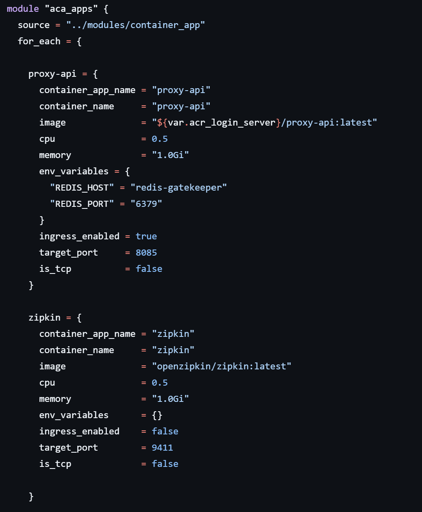

# 📦 Infrastructure Documentation
---
### Alejandro Córdova Erazo
### Alejandro Londoño Bermúdez
---

## ☁️ Used PaaS Providers

- **Microsoft Azure**
- **Amazon Web Services (AWS)**

## 🎯 Objective

The objective of this infrastructure phase is to provision all the necessary components to ensure a **scalable** and **sustainable deployment** for the different microservices that compose the **Microservices-TODOs APP** project.

To achieve this, the infrastructure setup was divided into **two key phases**:

---

## 🏗️ Phase 1 – Environment Setup for Microservices on Azure

This phase focuses on preparing the environment to host the microservices using **Azure Container Apps**.

### ✅ Components Created

- **Resource Group** – Logical container for all infrastructure resources.
- **Azure Container Registry (ACR)** – To store and manage container images of the microservices.
- **Azure Container Apps Environment (ACA Environment)** – Provides the execution context and shared resources for the ACA instances.
- **S3 Bucket (AWS)** – Stores the **Terraform remote state** to allow consistent and collaborative infrastructure management.

---

## 🚀 Phase 2 – Azure Container Apps Deployment per Microservice

Each microservice has its own Azure Container App instance created and deployed in this phase.

### 🧩 Rationale for the Two-Phase Strategy

Each microservice image is independently built in its respective repository. Therefore:

- **Each repository is responsible for building and registering its image in the shared ACR** provisioned in Phase 1.
- Once **all microservices have successfully registered their container images**, the **Infrastructure environment** proceeds to:
  - Deploy each **Azure Container App**,  
  - Pointing it to the respective, pre-validated image in the ACR.

This division of responsibilities promotes **modularity**, **clear ownership**, and a **seamless deployment pipeline**.

---

## 🛠️ Applied Tools and Workflow

The infrastructure components were provisioned using **Terraform**, following a modular and scalable design approach.

Two Terraform projects were created to manage the infrastructure in distinct but integrated phases:

### 1. `microservices` Project

This project handles **Phase 1**, which consists of creating the foundational infrastructure components. Upon successful execution, it exports the following outputs:

- `acr_login_server` – Login server URL of the Azure Container Registry  
- `acr_admin_username` – Admin username for the Azure Container Registry  
- `acr_admin_password` – Admin password for the Azure Container Registry *(sensitive)*  
- `identity_id` – User Assigned Identity ID  
- `container_app_environment_id` – The Container App Environment ID  
- `resource_group_name` – The Resource Group Name  
- `acr_name` – Name of the Azure Container Registry  

These outputs provide the base context required by the second project.

### 2. `container_apps` Project

This project handles **Phase 2**, which focuses on deploying Azure Container Apps. It consumes the output values from the `microservices` project to ensure consistency and avoid duplication.

---

### ⚙️ CI/CD Integration

The provisioning process is orchestrated through **GitHub Actions**. Output attributes from Phase 1 are securely passed to the corresponding microservice repositories as **secrets**. This ensures a **secure, modular, and scalable** integration between infrastructure provisioning and microservice image registration.

## ✅ Good Practices

A dedicated `container_apps` module was created to enable scalable management of both existing and new microservices. This modular approach allows each service to be defined and managed dynamically through the use of input variables.

